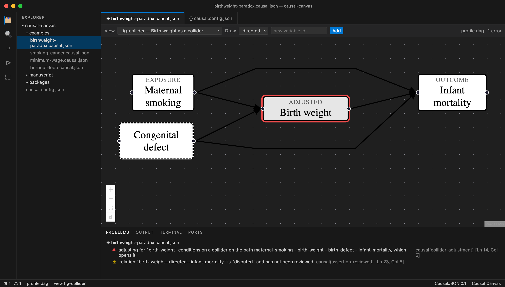

# Causal Canvas

**Draw causal models in VS Code. Ship the JSON.**

A visual editor for causal models whose real output is a plain,
schema-validated JSON file — not a picture. The diagram is a projection you can
throw away and regenerate. The model is the asset.

It also knows what a causal model _means_: it will tell you when you are
adjusting for a collider, when an instrument violates the exclusion restriction,
and when your exposure has no path to your outcome at all.

[causalcanvas.org](https://causalcanvas.org) · [Specification](spec/causaljson-0.1.md) · [Releasing](RELEASING.md)



_The birth weight paradox, caught. Adjusting for birth weight looks reasonable
and makes maternal smoking appear protective — because birth weight is a
collider._

## Install

```bash
# the VS Code extension
ext install pavlyshyn.causal-canvas

# the command line
npm install -g @causal-canvas/causalc
```

## A model is six lines

```json
{
  "causal": "0.1",
  "profile": "dag",
  "variables": ["smoking", "tar", "cancer"],
  "relations": ["smoking -> tar", "tar -> cancer"]
}
```

Longer form is there when an edge earns it — a kind, a confidence, a citation —
but you never pay for it up front.

```bash
causalc lint model.causal.json
causalc render model.causal.json --all --format svg --out figures/
```

## What it checks

Beyond schema and structure, it catches the mistakes that make causal work go
quietly wrong:

- **Collider adjustment** — conditioning on a collider, or a descendant of one,
  opening a spurious path.
- **Invalid instrument** — a directed path to the outcome that bypasses the
  exposure, violating the exclusion restriction.
- **No causal path** — a declared exposure with no directed path to the outcome.
- **Unidentifiable latent** — a latent variable with fewer than two children.
- **Unreviewed claims** — relations still marked `proposed`, so half-reviewed
  models cannot silently reach print.

Severities are yours to set in a `causal.config.json`, and the same rules run in
the editor, on the command line, and in CI.

## The format

Models are **CausalJSON**: JSON Schema-validated, JSON-LD-native, and readable
by anything that reads JSON.

- **Four profiles** — `dag`, `admg` (unmeasured confounding), `pag` (causal
  discovery output), `cld` (feedback loops). Bayesian-network and
  structural-equation content attach as additive layers, not separate formats.
- **Layout lives in views**, so moving a box never dirties the meaning and one
  model can define many figures.
- **Relations carry provenance** — who claimed this, with what standing and
  evidence — so a model stays trustworthy when an agent contributes to it.
- **Extensible** — anything under an `x-` prefix is yours, is never validated,
  and is never lost. Preserving it across a read-write cycle is a specification
  requirement, covered by tests.

## Layout

```
spec/              the CausalJSON specification, JSON Schema, JSON-LD context
packages/core      parse · normalize · validate · lint
packages/render     layout · SVG · PDF · PNG
packages/edits      surgical text edits over model documents
packages/cli        the causalc command
apps/vscode         the Causal Canvas extension
docs/               the website, and the served schema and context
examples/           worked models
conformance/        the corpus that defines the format by example
```

## Development

```bash
pnpm install
pnpm run build
pnpm run test
```

Open the repository in VS Code and press <kbd>F5</kbd> to launch the extension
against your working copy. `pnpm --filter causal-canvas run watch` rebuilds as
you edit.

## Privacy

No telemetry, no analytics, no update ping — the tools make no network requests
at all. The JSON Schema and JSON-LD context are bundled, so validation and
rendering work offline and on air-gapped machines. Your models never leave your
machine, because there is no server to send them to.

## Licence

Code under [Apache-2.0](LICENSE). Specification text under
[CC-BY-4.0](spec/LICENSE).
