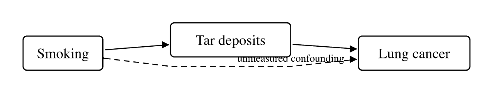

# Causal Canvas

Draw causal models in VS Code. Ship the JSON.

Causal Canvas is a visual editor for causal models whose real output is a plain,
schema-validated JSON file — not a picture. The diagram is a projection you can
throw away and regenerate. The model is the asset.

It also knows what a causal model _means_: it will tell you when you are
adjusting for a collider, when an instrument violates the exclusion restriction,
and when your exposure has no path to your outcome at all.


_Above: the birth weight paradox. Adjusting for birth weight looks reasonable
and makes maternal smoking appear protective — because birth weight is a
collider. Causal Canvas reports the exact path that opens, at the exact line._

---

## How you use it

**1. Make a file ending in `.causal.json`.** That extension is what activates the
editor. A complete model is six lines, and you can type it by hand:

```json
{
  "causal": "0.1",
  "profile": "dag",
  "variables": ["smoking", "tar", "cancer"],
  "relations": ["smoking -> tar", "tar -> cancer"]
}
```

**2. Open it.** VS Code opens it in the canvas. To see the JSON at the same
time, run **Causal Canvas: Open in Text Editor** — both edit the same document,
and each updates as you change the other.

**3. Edit it.**

| Action                   | How                                                                                                          |
| ------------------------ | ------------------------------------------------------------------------------------------------------------ |
| Move a variable          | Drag it. The position is written as a pin on the active view — never onto the variable itself.               |
| Draw a relation          | Drag from one variable's right edge to another's left edge.                                                  |
| Choose the relation kind | Pick it from the **Draw** dropdown before you draw. Only kinds legal for the document's profile are offered. |
| Add a variable           | Type an identifier in the toolbar box and press Enter.                                                       |
| Rename a label           | Double-click the variable, type, press Enter. The `id` never changes.                                        |
| Delete                   | Select and press Backspace. Deleting a variable removes its relations too, so nothing is left dangling.      |
| Switch view              | Pick from the **View** dropdown.                                                                             |

Everything you do is an ordinary text edit underneath, so **undo, save, and git
behave exactly as they do for any other file**.

**4. Watch the Problems panel.** Structural errors and causal lints appear as you
type, positioned at the member that caused them.

**5. Render the figure.** Run **Causal Canvas: Render Figure** and pick SVG, PDF,
or PNG. Or open **Causal Canvas: Open Figure Preview** to see the real
publication output beside the canvas while you work:



That figure is a build artifact. Change the model, re-render, and every figure
that depends on it updates — which is how a manuscript keeps its diagrams honest.

---

## What it checks

Beyond schema and structure, it catches the mistakes that make causal work go
quietly wrong:

- **Collider adjustment** — conditioning on a collider, or on a descendant of
  one, opening a spurious path.
- **Invalid instrument** — an instrument with a directed path to the outcome
  that bypasses the exposure, violating the exclusion restriction.
- **No causal path** — a declared exposure with no directed path to the outcome.
- **Unidentifiable latent** — a latent variable with fewer than two children.
- **Unreviewed claims** — relations still marked `proposed`, so half-reviewed
  models cannot silently reach print.

Severities are yours to set in a `causal.config.json` beside your models:

```json
{ "rules": { "assertion-reviewed": "error", "collider-adjustment": "error" } }
```

The same rules run in the editor and on the command line, so what fails in CI is
what you saw while editing.

---

## Commands

| Command                              | What it does                                     |
| ------------------------------------ | ------------------------------------------------ |
| `Causal Canvas: Render Figure`       | Render the active view to SVG, PDF, or PNG       |
| `Causal Canvas: Open Figure Preview` | Live preview of the real publication figure      |
| `Causal Canvas: Choose Active View`  | Pick the view used for rendering and preview     |
| `Causal Canvas: Format Document`     | Canonical formatting, preserving your extensions |
| `Causal Canvas: Open in Text Editor` | Open the same file as text, beside the canvas    |

## Settings

| Setting                              | Default   | Meaning                                                                                   |
| ------------------------------------ | --------- | ----------------------------------------------------------------------------------------- |
| `causalCanvas.figureFormat`          | `svg`     | Format offered first by Render Figure                                                     |
| `causalCanvas.figureOutputDirectory` | _(empty)_ | Where figures are written, relative to the workspace root. Empty writes beside the model. |
| `causalCanvas.preview.autoOpen`      | `false`   | Open the preview when a model is opened                                                   |

---

## The format, briefly

Models are **CausalJSON**: JSON Schema-validated, JSON-LD-native, and readable by
anything that reads JSON.

- **Four profiles.** `dag`, `admg` (unmeasured confounding), `pag` (causal
  discovery output), and `cld` (feedback loops). Bayesian-network and
  structural-equation content attach as additive layers, not separate formats.
- **Layout lives in views.** Moving a box never dirties the meaning, and one
  model can define many figures.
- **Relations can carry provenance** — who claimed this, with what standing,
  confidence, and evidence — so a model stays trustworthy when an agent
  contributes to it.
- **Extensible.** Anything under an `x-` prefix is yours, is never validated,
  and is never lost: preserving it across a read-write cycle is a specification
  requirement, covered by tests.

The specification ships in the project repository as `spec/causaljson-0.1.md`.

---

## Privacy

The extension makes **no network requests**. No telemetry, no analytics, no crash
reporting, no update ping. The JSON Schema and JSON-LD context are bundled, so
validation and rendering work fully offline and on air-gapped machines. Your
models never leave your machine, because there is no server to send them to.

---

## Building it locally

From the repository root:

```bash
pnpm install
pnpm run build
```

Then open the repository in VS Code and press **F5** to launch an Extension
Development Host. Open any file under `examples/` to see the canvas.

While iterating:

```bash
pnpm --filter causal-canvas run watch
```

To produce an installable package:

```bash
pnpm --filter causal-canvas run package    # writes causal-canvas-<version>.vsix
```

---

## What it will not do

Change the format. If the canvas cannot express something, that is a finding for
the specification, not a licence for the editor to invent syntax. Your
`.causal.json` files stay ordinary JSON — editable by hand, by the `causal` CLI,
and by any tool you write — whether or not this extension is installed.

Code under Apache-2.0. Specification under CC-BY-4.0.
